# Zen Zone

## About

Zen Zone is a yoga and wellness studio. On this site, we present all the necessary information about us and the amazing classes we provide. This site will be targeted to anyone in Bali, Seminyak who is looking for a place to find inner wellness.

The site can be accessed by this [link](https://bianca9901.github.io/zen-zone/)

---

## User Stories

### First-Time Visitor Goals:

* As a first-time visitor my goal is to find out what this yoga studio is about so that I can learn more.
*(who) Website is organized in a way that first-time visitors directly can see a description of who we are.*

* As a first-time visitor my goal is to find out where the yoga studio is located so that I can find the place.
*(where) First-time visitors should be able to find our location immediately since this is a local yoga studio. Therefore the location is provided in the header.*

* As a first-time visitor my goal is to find out what classes are provided so that I can decide if it suits my needs.
*(what) First-time visitors would want to know what classes we have in the studio. Therefore this information is provided directly after the header.*

### Returning Visitor Goals:

* As a returning visitor my goal is to contact the studio so that I can ask further questions.
*(contact) First-time visitors may have further questions, therefore the contact information is in the navigation bar.*

* As a returning visitor my goal is to see the schedule so that I can book a class.
*(when) A visitor that returns to the site may want to see the schedule for the classes. Therefore it has a link provided in the navigation so that the visitor easily can find the schedule of the week.* 

* As a returning visitor my goal is to find the studios' social media so that I can follow and interact with them.
*(interaction) A visitor that returns may want to follow and interact with us on social media to see more.*

### Frequent Visitor Goals:

* As a frequent visitor my goal is to see this week’s schedule so that I can book a class.
*(When) A frequent visitor may want to see the schedule for the week to book their spot.*

* As a frequent visitor my goal is to learn more about the memberships so that I can get a better deal.
*(Prices) Frequent visitors may be interested in getting a membership and potentially purchasing.*

---

## Existing features

### Navigationbar
* Features on both pages. With the content ‘’Home’’ ‘’Schedule’’ ‘’Membership’’ and ‘’Contact. 
* This makes it easy for the visitor to go to the relevant section and/or page.
* The navigation bar is responsive for all screen widths which secures a good user experience.
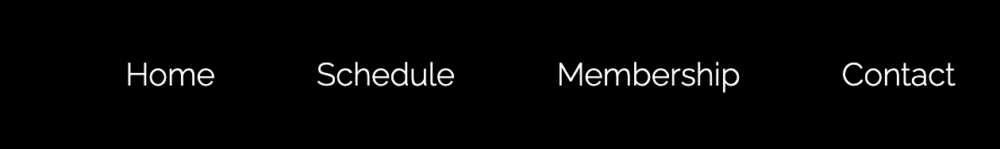

### Landing page
* The landing page image: The image gives a feel of our yoga studio and the text gives the visitor an impression of who and where we are.
* The intention of the text selected for the landing page is to intrigue the visitor to want to learn more. The image selected intends to give a sense of tranquilness which matches the core of the company and the goal of the visitor wanting to take a class in yoga and wellness. 
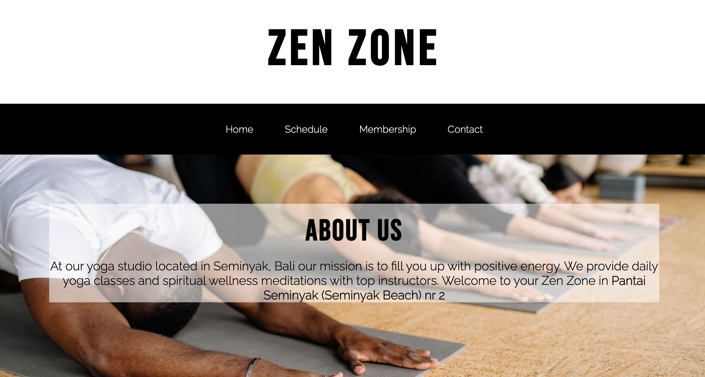

### Class selection section
* This section is meant to describe the different classes so that the visitor can know our selections.  The information should spark interest in the visitors and make them know what class they want to take.
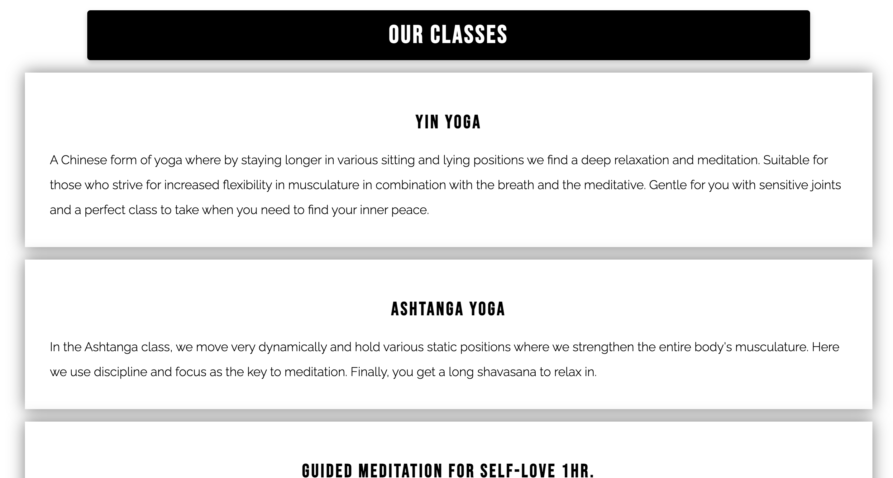

###  Schedule section
* This section shows the visitor the schedule of the week.
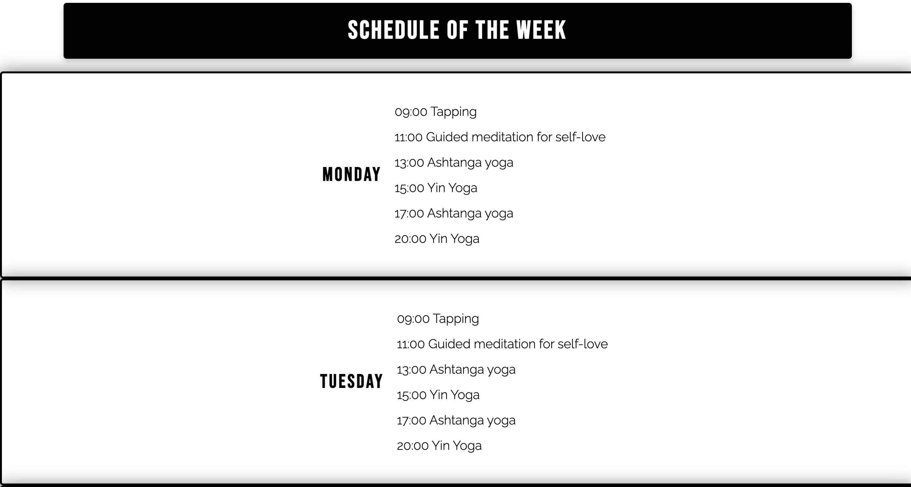

### Membership selection section
* Is meant to give the visitor information about the different prices and membership plans. It also includes rules for cancelation of membership etc. 
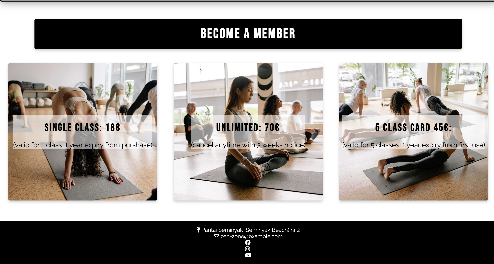

### The Footer
* Has social media icons that when pressed will open up in a new tab. It also has a general email for the studio's receptionists. And lastly, it has the location once again since it is important for a local studio.

### Contact-us page 

* Has a form where a ‘’personal instructor’’ will reach out and talk more in-depth about the questions the visitor may have. The user will have to put in first name, last name, and email and push send.
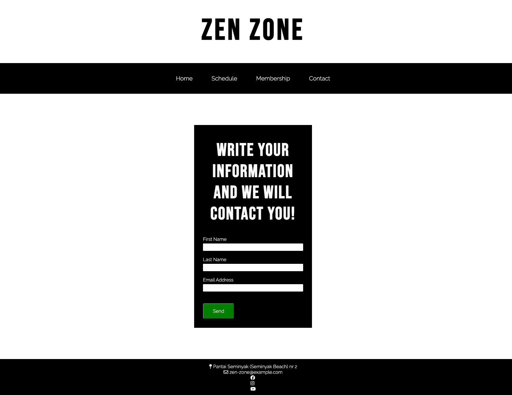

### Response page 
* Ensures the visitor that their request to get in contact has succeeded.
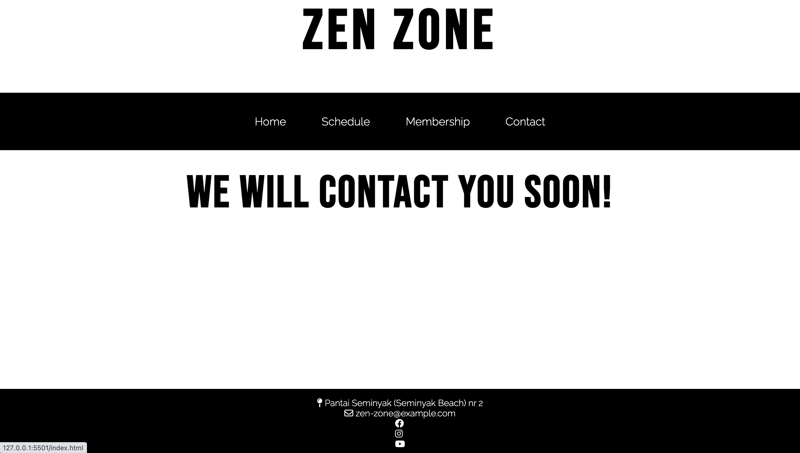

---

## Features Left to Implement
* A schedule that makes it possible for the visitor to secure their spot in a class.

* Images that support and complement the description of the different classes. So that the visitor can get a visual understanding as well. 

* A dropdown menu so that visitors on smaller screens get a better user experience.
---

## Technologies used

* [HTML](https://developer.mozilla.org/en-US/docs/Web/HTML)
was used for structuring the website.
* [CSS](https://developer.mozilla.org/en-US/docs/Web/CSS)
was used to style the website.
* [Codeanywhere](https://codeanywhere.com/)
was used to write my code. 
* [Flexbox](https://developer.mozilla.org/en-US/docs/Learn/CSS/CSS_layout/Flexbox)
was used to get the layout and to get the site responsive on different devices.
* [Balsamiq](https://balsamiq.com/)
was used to make the wireframe.
* [Github](https://github.com/)
was used to host the code on the website.
* [Git](https://git-scm.com/)
was used for version control.
* [Visual studio code](https://code.visualstudio.com/)
was used to write my code after half the time on this project since codeanywhere stopped working.
---
## Design

* The website has a simplistic modern feel with the main colors black and white. 
* A few elements are green and those are the button in the contact-us form. and also the social media icons and the menu options, but those are only green while hovering. 

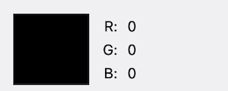
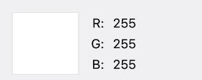
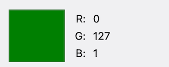

The logo, navigation bar, and footer were set to all pages with no change. In the content in between I kept a similar theme although the different sections and the two pages have a slightly different look. The purpose of this was for the visitor to acknowledge the different sections. This decision was made because a website with a lot of text can be overwhelming and therefore I wanted to make sure the sections did not melt into each other.

### Typography 

I used [Google Fonts](https://fonts.google.com/)  for all text. For the headlines, I used Bebas Neue Regular 400 and for paragraphs, I used Raleway Light 300.
#### Bebas Neue
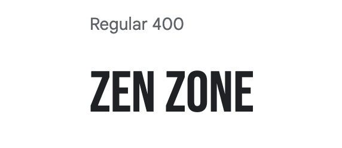
#### Raleway
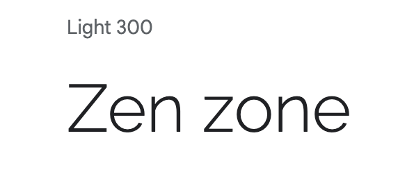

### Wireframes

#### I used [Balsamiq Wireframes](https://balsamiq.com/wireframes/) to make a mockup sketch of the layout before starting to code.

---

## Testing

### Validator testing
#### HTML
* Homepage 
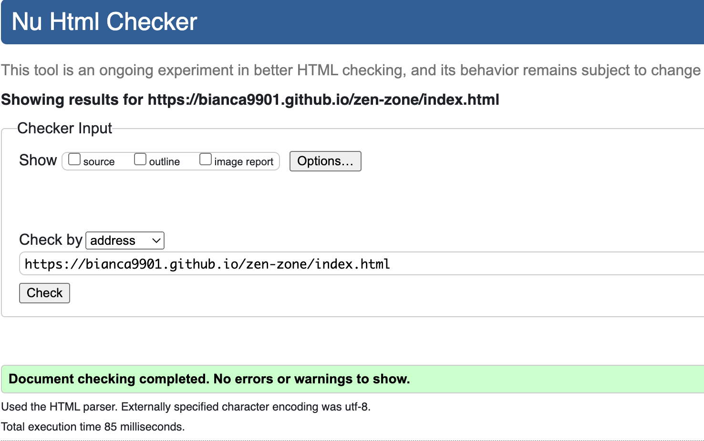

* Contact-us page
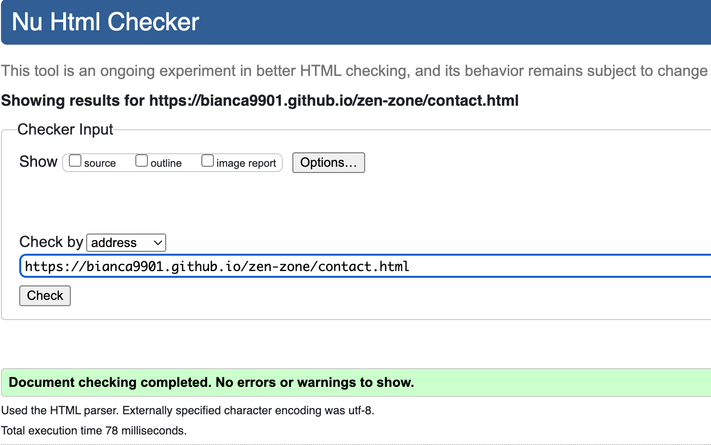

* Response page
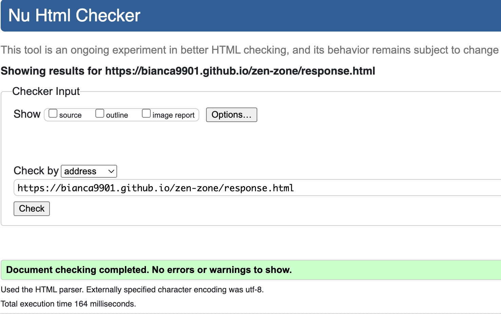

#### CSS
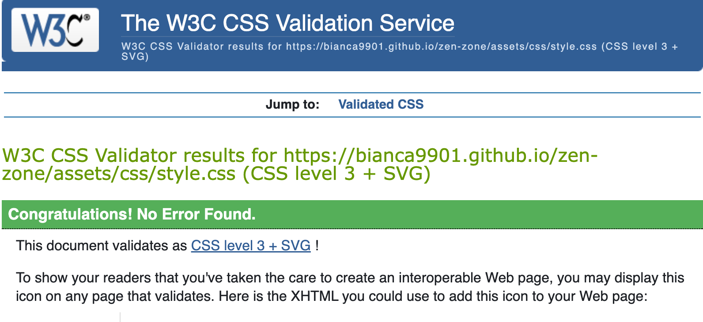

#### No errors were returned when passing through the official [W3C validator](https://validator.w3.org/) for the html. No errors were found when passing through the official [Jigsaw](https://jigsaw.w3.org/css-validator/validator.html.en) validator for css.
---
## Accessibility and performance scores
I used [lighthouse](https://developer.chrome.com/docs/lighthouse/overview/) to get approval that the site is performing well and that it is accessible.

* Home page
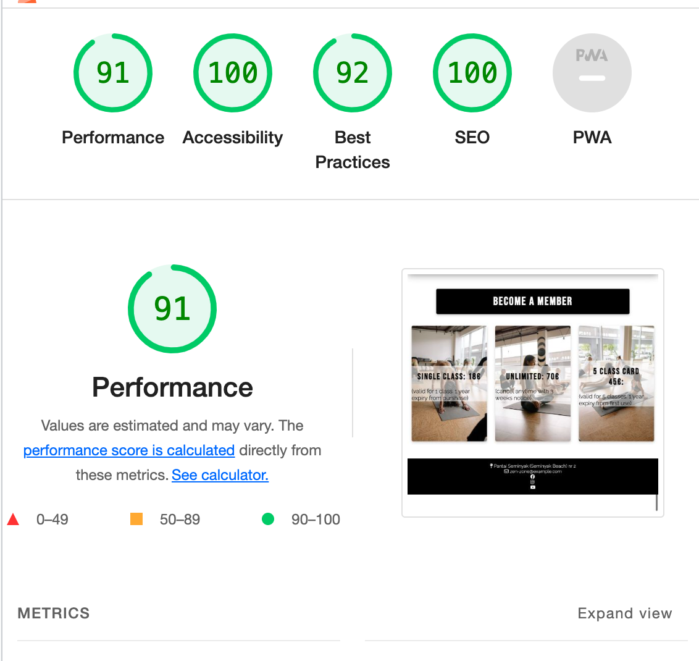

* Contact us page 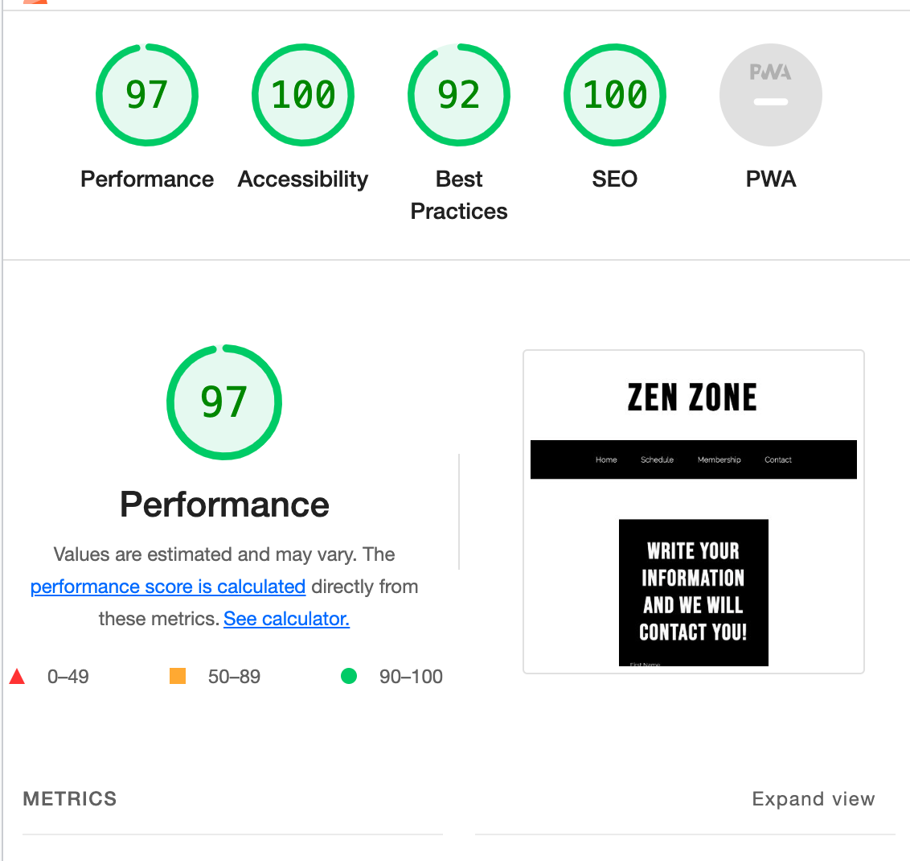

* Response page 

### Manual testing

| feature | action | expected result | tested | passed | comments |
| --- | --- | --- | --- | --- | --- |
| Navbar | | | | | |
| Home | Click on the "Home" link | The user is redirected to the main page | Yes | Yes | - |
| Schedule | Click on the "Schedule" link | The user is redirected to the schedule section | Yes | Yes | - |
| Membership | Click on the "Membership" link | The user is redirected to the membership section | Yes | Yes | - |
| Contact | Click on the "Contact" link | The user is redirected to the contact page | Yes | Yes | - |
| Footer | | | | | |
| Instagram icon in the footer | Click on the Instagram icon | The user is redirected to the Instagram page | Yes | Yes | - |
| Facebook icon in the footer | Click on the Facebook icon | The user is redirected to the Facebook page | Yes | Yes | - |
| YouTube icon in the footer | Click on the YouTube icon | The user is redirected to the YouTube page | Yes | Yes | - |
| Contact us page | | | | | |
| First name input | Enter the first name | The first name is entered | Yes | Yes | If the user doesn't enter the first name, the error message appears |
| Last name input | Enter the last name | The last name is entered | Yes | Yes | If the user doesn't enter the last name, the error message appears |
| Email input | Enter the email | The email is entered | Yes | Yes | If the user doesn't enter the email, the error message appears. If the user enters not valid email, the error message appears |
| "Send" button in contact form | Click on the "Send" button | The user is redirected to the Response page | Yes | Yes | - |
| Response page | | | | | |
| Response message | The user will be automatically redirected to the home page after 10 seconds | The user is redirected to the home page | Yes | Yes | - |

---
## Bugs

### Solved bugs
I had a bug with the footer but got it fixed with the help of [This link](https://materializecss.com/footer.html)

### Unsolved bugs
None

### Mistakes
In the beggining of the project I commited messengers that were
did not have an uppercase letter and they were also too long. When I realized this mistake I started writing properly.

--- 
## Deployment

* The site was deployed to GitHub pages. The steps to deploy are as follows:

* In the GitHub repository, navigate to the Settings tab
From the source section drop-down menu, select the Master Branch

* Once the master branch has been selected, the page will be automatically refreshed with a detailed ribbon display to indicate the successful deployment.

cd ~/Desktop     -  redirect you to your desktop
cd ciprojects     - redirect you to your folder with the projects
git clone https://github.com/bianca9901/zen-zone.git     - clone your repository
open -a "Visual Studio Code" zen-zone     - open your project in vs code

---

## Credits

### Content
The icons in the footer were taken from [Font Awesome](https://fontawesome.com/)

To compress my images I used [Tiny Png](https://tinypng.com)

To make the code for the box-shadow I used [Css Matic](https://www.cssmatic.com/box-shadow)

To make the scrolls behave more smoothly I used [W3schools](https://www.w3schools.com/cssref/pr_scroll-behavior.php)

I used information and code about flexbox from [W3schools](https://www.w3schools.com/css/css3_flexbox.asp)

For the contact form, I used the template for Love Running from [Code Institute](https://codeinstitute.net/)

For the footer that was bugging I used tips from [Materialize css](https://materializecss.com/footer.html)

I used [Digital Color Meter](https://support.apple.com/sv-se/guide/digital-color-meter/welcome/mac) for the screenshot of the colors in my website that I demonstrated in this README.md 

### Media 

All images from the website were taken from 
[Pexels](https://www.pexels.com/sv-se/)

[Hero image](https://www.pexels.com/sv-se/foto/manniskor-golv-kondition-traning-8436581/)

Membership cards images

[Img 1](https://www.pexels.com/photo/people-meditating-in-a-yoga-class-8436691/)

[Img 2](https://www.pexels.com/photo/women-meditating-in-a-yoga-class-8436728/)

[Img 3](https://www.pexels.com/id-id/foto/orang-orang-kebugaran-latihan-gaya-hidup-8436640/)

---

