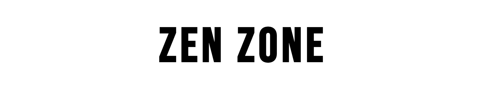
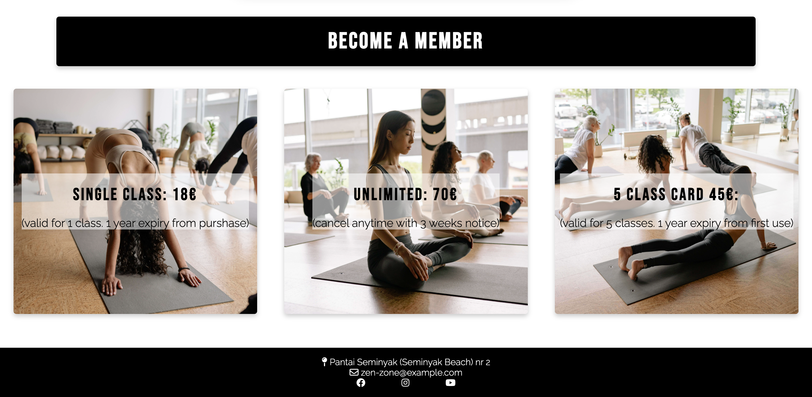
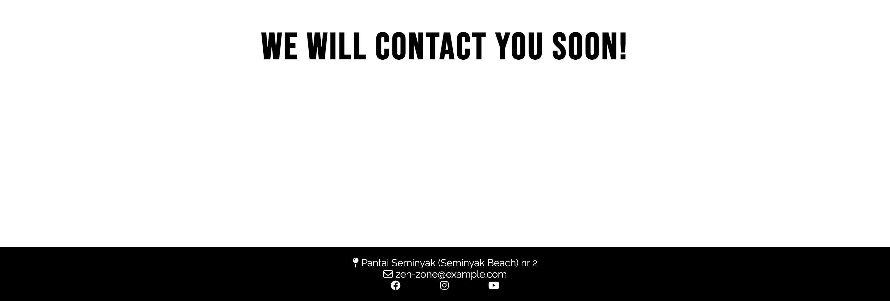
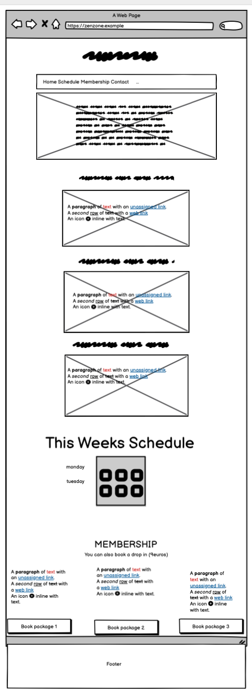
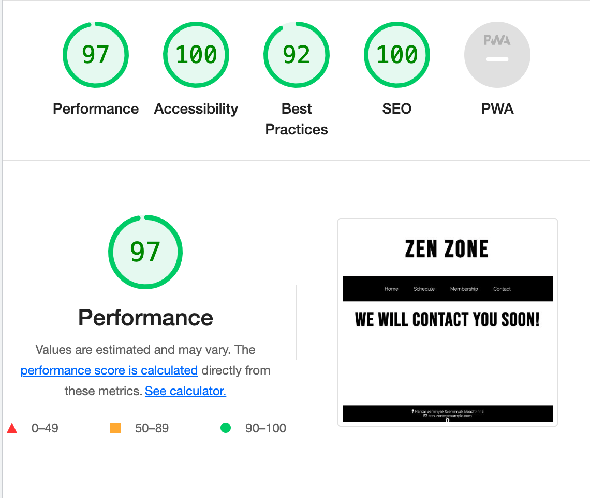

# Zen Zone

## About

Zen Zone is a yoga and wellness studio. On this site we present all necessary information about us and the amazing classes we provide. This site will be targeted to anyone in Bali, Seminyak who are looking for a place to find inner wellness.

The site can be accessed by this [link](https://bianca9901.github.io/zen-zone/)

---

## User Stories

### First Time Visitor Goals:

* As a first time visitor my goal is to find out what this yoga studio is about so that I can learn more.
*(who) Website is organized in a way that first time visitors directly can see a description of who we are.*

* As a first time visitor my goal is to find out where the yoga studio is located so that I can find the place.
*(where) First time visitors should be able to find our location immediately since this is a local yoga studio. Therefore the location is provided in the header.*

* As a first time visitor my goal is to find out what classes are provided so that I can decide if it suits my needs.
*(what) First time visitors would want to know what classes we have in the studio. Therefore this information is provided directly after the header.*

### Returning Visitor Goals:

* As a returning  visitor my goal is to contact the studio so that I can ask further questions.
*(contact) First time visitors may have further questions, therefore the contact information in the navigation bar.*

* As a returning visitor my goal is to see the schedule so that I can book a class.
*(when) A visitor that returns to the site may want to see the schedule for the classes. Therefore it has a link provided in the navigation so that the visitor easily can find the schedule of the week.* 

* As a returning visitor my goal is to find the studios social media, so that I can follow and interact with them.
*(interaction) A visitor that returns may want to follow and interact with us on social media to see more.*

### Frequent Visitor Goals:

* As a frequent visitor my goal is to see this week’s schedule, so that I can book a class.
*(When) A frequent visitor may want to see the schedule for the week to book their spot.*

* As a frequent visitor my goal is to learn more about the memberships so that I can get a better deal.
*(Prices) Frequent visitors may be interested in getting a membership and potentially purchase.*

---

## Existing features

### Navigation bar
* Features on both pages. With the content ‘’Home’’ ‘’Schedule’’ ‘’Membership’’ and ‘’Contact. 
* This makes it easy for the visitor to go to the relevant section and/or page.
* The navigation bar is responsive for all screen-widths which secure a good user experience.

### Landing page
* The landing page image: The image gives a feel of our yoga studio and the text gives the visitor an impression of who and where we are.
* The intention with the text selected for the landing page is to intrigue the visitor to want to learn more. The intent with the image selected is to give a sense of tranquilness which matches the core of the company and the goal of the visitor wanting to take a class in yoga and wellness. 

### Class selection section
* This section is meant to describe the different classes so that the visitor can know our selections.  The information should spark interest to the visitors and make them know what class they want to take.

###  Schedule section
* This section shows the visitor the schedule of the week.

### Membership selection section
* Is meant to give the visitor information about the different prices and membership plans. It also includes rules for cancelation of membership etc. 

### The Footer
* Has social media icons that when pressed will open up in a new tab. It also has a general email for the studio's receptionists. And lastly it has the location once again since it is important for a local studio.

### Contact-us page 

* Has a form where a ‘’personal instructor’’ will reach out and talk more in depth about the questions the visitor may have. The user will have to put in first name, lastname and email and push send.

### Response page 
* Insures the visitor that their request to get in contact has succeeded.

---

## Features Left to Implement
* A schedule that makes it possible for the visitor to secure their spot in a class.

* Images that support and complement the description of the different classes. So that the visitor can get a visual understanding as well. 

* A dropdown menu so that visitors on smaller screens get a better user experience.
---

## Technologies used

* HTML
was used for structuring the website.
* CSS
was used to style the website.
* Codeanywhere
was used to write my code. 
* Flexbox
was used to get the layout and to get the site responsive on different devices.
* Balsamiq
was used to make the wireframe.
* Github
was used to host the code on the website.
* Git
was used for version control.
* Vscode
was used to write my code after half the time on this project since codeanywhere stopped working.
---
## Design

The website has a simplistic modern feel with the main colors black and white. A few elements are green and those are the button in the contact-us form. and also the social media icons and the menu options, but these are only green while hovering. 

The logo, navigationbar and footer was set to all pages with no change. In the content in between I kept a similar theme although the different sections and the two pages has a slightly different look. The purpose of this was for the visitor to acknowledge the different sections. This decision was made because a website with a lot of text can be overwhelming and therefore I wanted to make sure the sections did not melt into each other.

### Typogrophy 

I used [Google Fonts](https://fonts.google.com/)  for all text. For the headlines I used Bebas Neue Regular 400 and for paragraphs I used Raleway light 300.
* Bebas Neue

* Raleway

### Wireframes

I used [Balsamiq Wireframes] (https://balsamiq.com/wireframes/) to make a mockup sketch of the layout before starting to code.

---

# Testing

## Validator testing
### HTML
#### Homepage 
 "Document checking completed. No errors or warnings to show."

#### Contact-us page
"Document checking completed. No errors or warnings to show."

#### Response page
"Document checking completed. No errors or warnings to show."

### CSS
''Congratulations! No Error Found.''

#### No errors were returned when passing through the official [W3C validator](https://validator.w3.org/) for the html. No errors were found when passing through the official [Jigsaw](https://jigsaw.w3.org/css-validator/validator.html.en) validator for css.

### Accessibility and performance scores
I used [lighthouse](https://developer.chrome.com/docs/lighthouse/overview/) to get approval that the site is performing well and that it is accessible.

Home page

Contact us page 

Response page 

### Manual testing

### Bugs

##### Solved bugs
I had a bug with the footer but got it fixed with help of [This link](https://materializecss.com/footer.html)

##### Unsolved bugs
None

## Deployment

cd ~/Desktop     -  redirect you to your desktop
cd ciprojects     - redirect you to your folder with the projects
git clone https://github.com/bianca9901/zen-zone.git     - clone your repository
open -a "Visual Studio Code" zen-zone     - open your project in vs code

## Credits

### Content
The icons in the footer were taken from [Font Awesome](https://fontawesome.com/)

To compress my images I used [Tiny Png](https://tinypng.com)

To make the code for the boxshadow I used [Css Matic](https://www.cssmatic.com/box-shadow)

To make the scrolls behave more smoothly I used [W3schools](https://www.w3schools.com/cssref/pr_scroll-behavior.php)

I used information and code about flexbox from [W3schools](https://www.w3schools.com/css/css3_flexbox.asp)

For the contact form I used the template for Love Running from [Code Institute](https://codeinstitute.net/)

For the footer that was bugging I used tips from [Materialize css](https://materializecss.com/footer.html)

I used this app to demonstrate in this README.md document the screenshots of the colors i picked for the website. 
[Digital Color Meter](https://support.apple.com/sv-se/guide/digital-color-meter/welcome/mac)

### Media 

All images from the website was taken from 
[Pexels](https://www.pexels.com/sv-se/)

[Hero image](https://www.pexels.com/sv-se/foto/manniskor-golv-kondition-traning-8436581/)

Membership cards images

[Img 1](https://www.pexels.com/photo/people-meditating-in-a-yoga-class-8436691/)

[Img 2](https://www.pexels.com/photo/women-meditating-in-a-yoga-class-8436728/)

[Img 3](https://www.pexels.com/id-id/foto/orang-orang-kebugaran-latihan-gaya-hidup-8436640/)

Mistakes, commiting messengers that are too long and does not have uppercase letter. When I realized this misstake I corrected all commits after.

